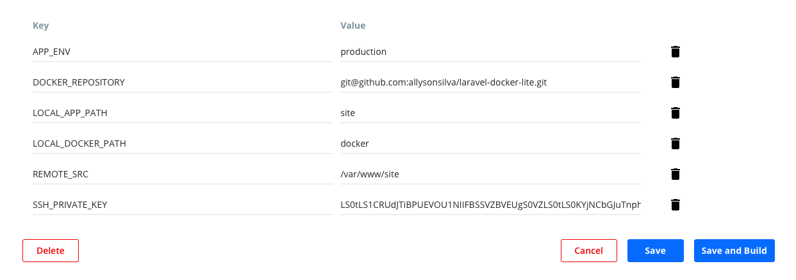

# [Configuração Builds/CI Docker Hub](https://docs.docker.com/docker-hub/builds/)

> Repositório para **hooks**/configurações de construção de imagens utilizando builds do *Docker Hub*.

## Overview

- **Hooks** que manipulam a construção/build de imagens.
- Organização de pastas da *aplicação* + *projeto docker* utilizado na construção/build das imagens(`docker build`) é referenciado por meio do [repositório docker](https://github.com/allysonsilva/laravel-docker-lite/).
- Pasta de `hooks` deve estar no mesmo nível da configuração de build na interface no Docker Hub no campo *Dockerfile location*.
- Variáveis de ambiente definidas na tela de configuração de build na interface no Docker Hub podem ser utilizadas pelos comandos `docker` nos `hooks`.

## Getting Started

- Para ativar os [hooks](https://docs.docker.com/docker-hub/builds/advanced/#custom-build-phase-hooks) do *Automated Build* no *Docker Hub* é necessário copiar a pasta `docker-hub` para a pasta raiz da aplicação.

- Clonar o repositório com o nome da pasta específica de `docker-hub`.

  ```bash
  git clone https://<url-repositorio> docker-hub
  ```

**Os seguintes *hooks* serão aplicados**:

- **build**: Criação das imagens com argumentos personalizados.
- **post_push**: Executado após realizar o push da tag da imagem principal. Utilizado para realizar push de imagens personalizadas ou adicionais.
- **pre_build**: Configuração/preparação do ambiente e da aplicação.

## [Configure automated build settings](https://docs.docker.com/docker-hub/builds/#configure-automated-build-settings)

Regras de build(*BUILD RULES*) na tela de edição nas configurações de build, deve estar com os seguintes valores:

- _**Dockerfile location**_: `docker-hub/Dockerfile`
- _**Build Context**_: `/`

Variáveis de ambiente utilizadas para construção da imagem para passagem de argumentos personalizados devem estar presentes:

- **`APP_ENV`**: `production` || `local`
- **`DOCKER_REPOSITORY`**: `git@github.com:account/docker.git`
- **`LOCAL_APP_PATH`**: `site` || `admin` || `xyz`
- **`LOCAL_DOCKER_PATH`**: `docker`
- **`REMOTE_SRC`**: `/var/www/(site|admin|xyz)`
- **`SSH_PRIVATE_KEY`**: `base64 ~/.ssh/id_rsa | pbcopy`

Veja a imagem abaixo com os valores das variáveis de ambiente:


